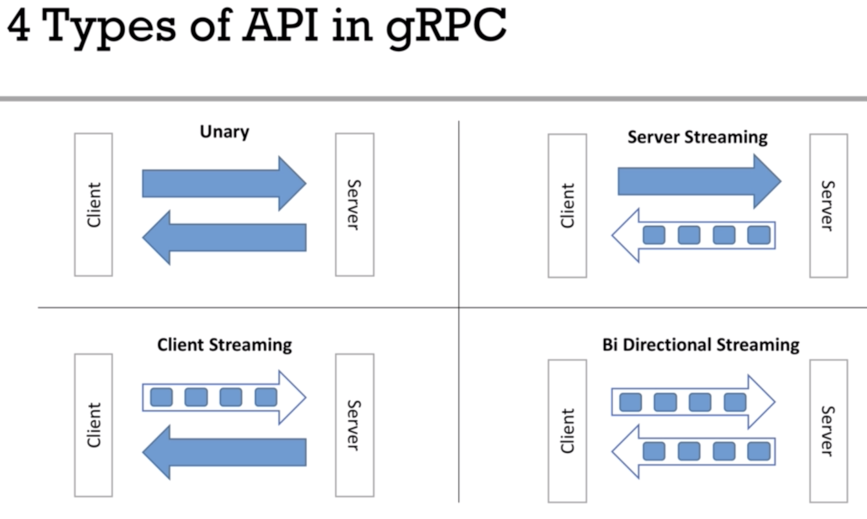
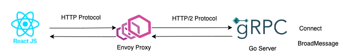

### gRPC Stream

Demo some type of gRPC response (unary or stream)

- Start server
- Generate protoc
- update client.py to exec corresponding streams type (client-stream, server-stream, bidirectional-stream)



### Demo chat app

<video controls>
  <source src="images/chat_demo.mov" type="video/mp4">
</video>



```
    make protoc
    make protoc-js
```

Interactive

```
    go mod tidy
    make server
    make client
```

ReactJs

```
    make server
    envoy -c envoy.yaml
    cd frontend && npm run dev
```

### Reference:

    https://github.com/tensor-programming/docker_grpc_chat_tutorial
    https://qiita.com/okmttdhr/items/a37563047904ac98f3ed
    https://qiita.com/kawamou/items/96d815b41c4c27e4537b
